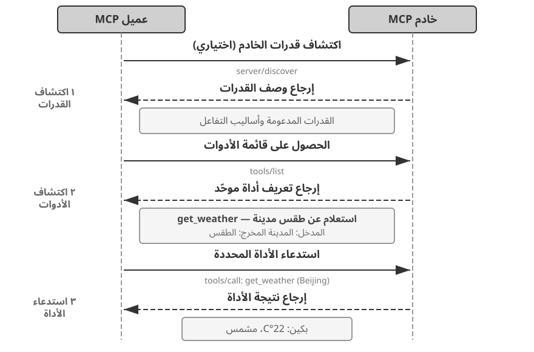

# الفصل الرابع: الأدوات

في فيلم الخيال العلمي *Her*، تملك المساعدة الذكية Samantha القدرة على ترتيب البريد الإلكتروني تلقائيًا، والتعرف على الرسائل ذات الطابع العاطفي المعقد واقتراح صياغة معدلة لها، ومتابعة أمور النشر بالنيابة عن البطل، والتنقل بسلاسة بين قنوات التواصل المختلفة. إن ما يجعل ذكائها مبهرًا وملموسًا هو امتلاكها **أدوات** قوية — "أيديًا وأقدامًا وحواسّ" تربط "العقل" اللغوي بالعالم الرقمي الحقيقي.

ومع ذلك، لبناء مثل هذا المساعد باستخدام التقنيات المتاحة اليوم، يتعين علينا حل تحديين محوريين:

1. **تحدي اختيار الأدوات (Tool Selection Challenge)**: عندما تتجاوز وثائق التوضيح لآلاف الأدوات سعة نافذة السياق (Context Window)، كيف يمكن لـ Agent العثور بكتشاف ودقة على الأداة المناسبة لإنجاز المهمة؟ وكيف ننتقل من "الاختيار" السلبي للأدوات إلى "الكتشاف" النشط لها؟ يركز هذا الفصل على مبادئ تصميم الأدوات، وحالة النظام البيئي الحالي، والكتشاف النشط في مقاييس الاستخدام الواسعة؛ أما جعل Agent يبتكر الأدوات ويعدلها ويستبعدها تلقائيًا بناءً على خبرة التشغيل فسوف يُرجأ تفصيله إلى الفصل الثامن.
2. **تحدي التزامن والأحداث (Async & Event-Driven Challenge)**: كيف يدير Agent المهام المستغرقة لوقت طويل، ويتعامل مع المقاطعات الصادرة من المستخدم أو النظام في أي وقت، ويستجيب للأحداث الخارجية القادمة من البريد والتقويم وتنبيهات النظام دون الوقوع في جمود الانتظار المتزامن؟

يدور هذا الفصل حول هذين التحديين. يبدأ بتقديم نظرة شاملة لتصنيف الفئات الخمس للأدوات؛ ثم يناقش المبادئ العامة للتصميم الصالحة لجميع الأدوات، وكيف يوفر بروتوكول MCP توحيدًا للنظام البيئي للأدوات، وكيف نعتمد عليه وعلى التنظيم الهرمي والاكتشاف الديناميكي والمهارات (Skills) لمواجهة تحديات اختيار الأدوات؛ ثم يستعرض الفئات الثلاث للأدوات التي يستدعيها Agent بشكل نشط — الإدراك، التنفيذ، والتعاون؛ يلي ذلك مناقشة بنية Agent اللا متزامنة الموجهة بالأحداث، وأدوات إطلاق الأحداث وأدوات التواصل مع المستخدم المعتمِدة على هذه البنية؛ وأخيرًا يختتم الفصل بموضوع "الكتشاف النشط للأدوات" للإجابة عن كيفية الاكتشاف عند تضخم عدد الأدوات للمئات أو الآلاف. وبناءً على ذلك، سيتم تفصيل كيفية تحويل مسارات استخدام الأدوات المقيَّمة إلى قدرات جديدة في الفصل الثامن (التطور المستمر لـ Agent).

## تصنيف الأدوات

قدم الفصل الأول الفئات الخمس لأدوات Agent (الإدراك، التنفيذ، التعاون، إطلاق الأحداث، التواصل مع المستخدم). ولمساعدة القارئ على فهم الفروق التصميمية بين هذه الفئات الخمس، يمكن فحصها من خلال بعدين أساسيين: **اتجاه الاستدعاء** (من الذي يبادر بالتفاعل) و**الموضوع المستهدف** (على ماذا يؤثر التفاعل). وتجدر الإشارة إلى أن هذين البعدين لا يشكلان إطار تصنيف تقاطعي مغلق — فلكل فئة قيمتها الخاصة في "الموضوع المستهدف" — وإنما الهدف هو مساعدة القارئ على الاستيعاب السريع لسياق كل فئة. يلخص الجدول 4-1 هذين البعدين للفئات الخمس لتسهيل مناقشة تركيز التصميم لكل منها لاحقًا.

جدول 4-1 اتجاه الاستدعاء والموضوع المستهدف للفئات الخمس من الأدوات

| نوع الأداة | اتجاه الاستدعاء | الموضوع المستهدف |
|---------|---------|---------|
| أدوات الإدراك (Perception) | استدعاء نشط من Agent | الحصول على المعلومات |
| أدوات التنفيذ (Execution) | استدعاء نشط من Agent | تغيير العالم الخارجي |
| أدوات التعاون (Collaboration) | استدعاء نشط من Agent | توجيه وكلاء آخرين أو البشر |
| أدوات التواصل مع المستخدم (User Communication) | استدعاء نشط من Agent | نقل المعلومات للمستخدم |
| أدوات إطلاق الأحداث (Event-Triggered) | تسجيل من Agent، وتحفيز من الخارج | دفع Agent للبدء بالتنفيذ |

**أدوات الإدراك** هي الوسيلة التي يحصل بها Agent على المعلومات ويدرك بها العالم. على سبيل المثال: أداة البحث في الويب (`web_search`)، أداة البحث في قاعدة المعرفة الداخلية (`knowledge_base_search`)، أداة قراءة صفحات الويب (`fetch_url`)، أداة البحث عن أسماء الملفات (`find_file`)، أداة البحث في محتوى الملفات (`grep_file`)، وأداة قراءة الملفات (`read_file`). يكمن المفتاح التصميمي لأدوات الإدراك في الموازنة بين دقة الحبيبات (Granularity) والتحكم في حجم المعلومات المخرجة.

**أدوات التنفيذ** هي الطرق التي يغير بها Agent العالم الخارجي. على سبيل المثال: أداة سطر الأوامر (`shell_exec`)، أداة مفسر الشفرة (`code_interpreter`)، أداة كتابة الملفات (`write_file`)، أداة تعديل الملفات (`edit_file`)، وأداة إرسال البريد الإلكتروني (`send_email`). وعلى عكس أدوات الإدراك، فإن تكلفة الخطأ في أدوات التنفيذ قد تكون باهظة للغاية، ولذلك تُعد القيود الأمنيّة المحور الأساسي لتصميمها.

**أدوات التعاون** هي الطريقة التي يتعاون بها Agent مع غيره من الوكلاء والبشر. على سبيل المثال: إنشاء وكيل فرعي (`spawn_subagent`)، إرسال رسالة لوكيل فرعي (`send_message_to_subagent`)، إلغاء وكيل فرعي (`cancel_subagent`)، واكتشاف الوكلاء المتاحين في النظام (`list_agents`). وأبسط سبب لحاجة Agent للتعاون هو التنفيذ المتوازي لمهام متعددة غير مرتبطة، كالبحث المتوازي عن المؤسسين المشاركين لـ OpenAI؛ أما الأسباب الأكثر تعقيدًا فتشمل استخدام نماذج وأدوات وموجهات (Prompts) وسياقات مختلفة لتنفيذ مهام متنوعة لتحقيق نتائج أفضل. وسيشرح الفصل العاشر بنية الوكلاء المتعددين بالتفصيل.

**أدوات التواصل مع المستخدم** هي الوسيلة التي ينقل بها Agent المعلومات إلى المستخدم بشكل نشط. على سبيل المثال: الرد على رسالة المستخدم (`reply_to_user`)، إرسال بطاقة رسالة هيكلية (`send_card_to_user`)، وإرسال إشعار تنبيه للمستخدم (`send_user_notification`). عندما يتوسع التواصل بين Agent والمستخدم من سؤال وجواب في جلسة واحدة إلى رسائل غير متزامنة عبر قنوات متعددة، يصبح "الحديث" ذاته بحاجة لأن يكون استدعاءً صريحًا لأداة.

**أدوات إطلاق الأحداث** هي الطريقة التي يحفز بها العالم الخارجي تصرفات Agent. على سبيل المثال: ضبط المؤقت (`set_timer`)، مراقبة مهام سطر الأوامر في الخلفية (`monitor_shell`)، والربط بمصادر الأحداث الخارجية (`connect_channel`). تتضمن هذه الأدوات لحظتين: **التسجيل** حيث يستدعي Agent الأداة بنشاط ليعلن اهتمامه بحادثة معينة؛ و**التحفيز** حيث يتم استدعاء الأداة بشكل غير متزامن بواسطة حدث خارجي لإيقاظ Agent للبدء بالمعالجة — وهذا هو معنى "تسجيل من Agent، وتحفيز من الخارج" في الجدول 4-1. وبدون أدوات إطلاق الأحداث، يظل Agent قادرًا فقط على الرد السلبي عند بدء المستخدم للحوار، دون القدرة على التصرف المستقل في وقت محدد أو الاستجابة لرسائل البريد الجديدة وتنبيهات النظام.

تُستدعى الفئات الأربع الأولى بنشاط من قبل Agent، وسيتم تفصيل تصميم كل منها لاحقًا؛ بينما لا ينفصل تصميم أدوات إطلاق الأحداث عن البنية غير المتزامنة الموجهة بالأحداث، وسوف يتم تناوله في الجزء الثاني من هذا الفصل في قسم "Agent غير المتزامن الموجه بالأحداث". وفيما يلي نقدّم أولاً المبادئ العامة للتصميم الصالحة لجميع الأدوات.

## المبادئ العامة لتصميم الأدوات

### اختيار شكل التعبير عن القدرة: أدوات مخصصة أم Skill + منفّذ عام

قبل مناقشة أنواع الأدوات المحددة، من الضروري الإجابة عن سؤال تصميمي أكثر أساسية: بأي شكل ينبغي التعبير عن قدرات Agent؟ ستناقش الأقسام التالية الحبيبية والعمومية وفنون الوصف، لكن كل ذلك يرتكز على فرضية "وجوب جعلها أداة مخصصة". في الواقع، هناك شكلان أساسيان للتعبير عن قدرات Agent:

- **أدوات الشفرة المخصصة (Dedicated Code Tools)**: استدعاءات دالة هيكلية تتميز بالحتمية العالية والقابلية للاختبار، ولكن كل أداة تستهلك مئات الرموز (Tokens)، كما أن تضخم عددها يضرب كفاءة ذاكرة التخزين المؤقت للمفاتيح والقيم (KV Cache).
- **المهارة + المنفّذ العام (Skill + General Executor)**: استخدام وثائق Skill المكتوبة باللغة الطبيعية لوصف خطوات العمل، ويقوم Agent بتنفيذها عبر الطرفية أو مفسر الشفرة، بحيث تكفي أدوات عامة قليلة لتغطية عدد ضخم من السيناريوهات (مثل الأدوات السبع الأساسية التي سيبينها الفصل الخامس).

على سبيل المثال: وثيقة Skill لـ "نشر تطبيق" قد تُكتب بالشكل: `1. شغل npm run build لبناء المشروع؛ 2. شغل docker build -t app:latest . لتحزيم الصورة؛ 3. شغل kubectl apply -f deploy.yaml للنشر على العنقود` — ينفذ Agent هذه التعليمات خطوة بخطوة عبر أداة bash دون الحاجة لإنشاء أدوات مخصصة لكل خطوة.

يعتمد الاختيار بين الشكلين على ثلاثة أبعاد:

- **تعقيد المعاملات**: العمليات التي تتضمن كائنات متداخلة أو تحققات مشتركة بين حقول متعددة أو قيود أنواع معقدة، يوفر لها المخطط الهيكلي (Schema) للأداة المخصصة توجيهًا أفضل للنموذج لتمرير المعاملات بشكل صحيح؛ أما العمليات بسيطة المعاملات فتمريرها عبر أوامر CLI يكون موثوقًا بنفس القدر.
- **تكرار التغيير**: القدرات التي تتغير باستمرار يُعد صيانها عبر Skill أقل تكلفة بكثير من الأدوات المخصصة — فعديل نص أسهل بكثير من تعديل الشفرة واختبارها ونشرها؛ بينما العمليات الأساسية المستقرة تناسب أكثر الأدوات المخصصة.
- **قدرة النموذج**: يمكن لنماذج SOTA التعبير عن قدرات أكثر وتقليل عدد الأدوات باستخدام Skill + المنفذ العام؛ بينما تحتاج النماذج الأضعف إلى مخططات هيكلية للأدوات لتوجيه الاستدعاء الصحيح. وسيناقش الفصل الثامن كيفية اتخاذ نفس الاختيار عند ترسيخ قدرات جديدة لـ Agent أثناء تطوره المستمر.

### الموازنة في حبيبية الأدوات: الدمج والفصل

تُعد حبيبية الأداة نقطة قرار حاسمة. الحبيبية الدقيقة جدًا تؤدي لقفزة في عدد الأدوات، مما يزيد عبء الاختيار على LLM؛ بينما الحبيبية الخشنة تجعل الأداة الواحدة معقدة للغاية. وعندما يتضخم عدد الأدوات (مثلاً أكثر من 100 أداة)، يسهل حتى على أحدث النماذج اللغوية الوقوع في الخطأ عند اختيار الأداة.

المعيار الأساسي للحكم على وجوب الدمج هو **التشابه الوظفي** و**تداخل سيناريوهات الاستخدام**. وبالنظر لمعالجة المستندات كمثال، فإن الأدوات مثل `extract_pdf_text` و`extract_docx_content` و`extract_pptx_content` تشترك في: استخراج النص من المستندات، المدخل هو مسار الملف، والمخرج هو سلسلة نصية. التصميم الأفضل هو تقديم أداة موحدة `read_document` تُفرّق بين التنسيقات عبر معامل `file_type`. يقلل الدمج **العبء المعرفي على LLM** (يكفي فهم قاعدة بسيطة "لقراءة المستندات استخدم `read_document`")، **ويجعل الوصف أوضح**، **ويسهل التوسع** (لدعم تنسيق جديد يكفي إضافة خيار في `file_type`). ولكن ليس كل الأدوات يجب دمجها — على سبيل المثال تحليل الصور (OCR) وتحليل الفيديو (استخراج الإطارات المفتاحية) ورغم كونهما "استخراج محتوى"، إلا أن أشكال المعاملات وخصائص التأخير تختلف كثيراً، ودمجها قسراً يغيم المعنى الدلالي للواجهة.

عندما تختلف مجموعات المعاملات بشكل كبير رغم تشابه الوظيفة، أو عندما يكون تكرار استخدام وظيفة ما مرتفعاً للغاية، فإن الحفاظ على استقلاليتها يكون أكثر عقلانية.

### تصميم عمومية الأدوات (Generality Design)

**الأدوات العامة أفضل من الأدوات المخصصة، ما لم توجد أسباب صريحة تتعلق بالأمان أو الصلاحيات أو الأداء** — على سبيل المثال `code_interpreter` يوفر الرموز (Tokens) ويكون أكثر مرونة مقارنة بعشرات الآلات الحاسبة المخصصة، ولكن في سيناريوهات تتضمن عمليات كتابة على قواعد بيانات الإنتاج، توفر الأدوات المخصصة تحكماً أدق بالصلاحيات وتدقيقاً أفضل. وبالعودة لمثال الحساب: بدلاً من تقديم حاسبة للعمليات الحسابية الأربع، من الأفضل تقديم أداة عامة `code_interpreter` وتثبيت مكتبات مثل sympy وnumpy وpandas في بيئة المعزل (Sandbox)، ليتيح لـ Agent إنجاز أي حسابات رياضية عبر تنفيذ شفرة Python.

المنطق خلف هذه القاعدة هو: **يمتلك LLM بحد ذاته قدرات قوية على التفكير وتوليد الشفرة، وينبغي لنا استغلال هذه القدرة لا تقييدها**. تقديم أداة عامة يعادل منح Agent "قدرة فائقة" — فمفسر Python واحد يمكنه استبدال عشرات الأدوات ذات الوظائف المحددة، كما يستطيع التعامل مع حالات حافة لم تكن متوقعة مسبقاً.

لكن للعمومية حدودها أيضاً. فالعمليات التي تتطلب صلاحيات خاصة أو إعدادات معقدة أو تنطوي على مخاطر أمنية، تظل بحاجة إلى أدوات مخصصة محزومة بشكل جيد.

### فن وصف الأدوات (Art of Tool Description)

تحدد جودة وصف الأداة مباشرة مدى دقة استخدام Agent لها.

جوهر وصف الأداة هو إعلام LLM "متى يستخدمها"، وليس فقط "ما الذي يمكنها فعله". بالنظر للبحث في الويب كمثال، فإن القول "البحث عن محتوى ذي صلة" أقل فعالية بكثير من القول "يستخدم عند الحاجة للحصول على معلومات مباشرة أو البحث عن حقائق غير معروفة" — الأول يكتفي بوصف الوظيفة، بينما يساعد الثاني LLM في اتخاذ قرار الاستدعاء.

الحدود مهمة بنفس القدر. يجب أن يوضح وصف أداة البحث عن الملفات أنها تطابق بناءً على اسم الملف فقط ولا يمكنها البحث في محتوى الملف — فإذا غاب هذا التوضيح المضاد، سيلجأ LLM للتخمين. **إن الإدراج الصريح للشروط الحدّية للأداة — ما لا يمكنها فعله، وما لا تقبله كمدخلات — غالبًا ما يكون أكثر أهمية من وصف القدرة نفسها**، لأن معظم إخفاقات استدعاء الأدوات لا تعود لعدم معرفة النموذج بما تفعل الأداة، بل لعدم معرفته بما لا تفعل.

يجب استخدام أمثلة ملموسة في وصف المعاملات بدلاً من القواعد المجرّدة. "`timestamp`: بتنسيق RFC3339، مثل `2024-03-15T14:30:00Z`" أكثر فعالية بكثير من كتابة "`timestamp`: بتنسيق RFC3339". ورغم أن LLM يفهم هذه المصطلحات عند التركيز على مسألة واحدة، إلا أنه عند تنفيذ مهام معقدة — تتطلب التعامل مع أدوات متعددة واستخلاص المعلومات من المسار التاريخي والموازنة بين قرارات عدة — فإن التأكد من تنسيق المعاملات لا يستهلك إلا جزءاً ضئيلاً من انتباهه، مما يسهل وقوع الأخطاء.

المخرجات بحاجة للوضوح أيضاً — توضيحات مثل "يرجع مصفوفة JSON، كل عنصر يحتوي الحقول `title` و`url` و`snippet`" تقلل أخطاء التحليل لاحقاً.

إلى جانب وصف المعاملات والمخرجات بنداً بنداً، ينبغي إرفاق 1-5 أمثلة استدعاء حقيقية مع كل أداة. يساعد إدراج الأمثلة عادة في رفع دقة استدعاء الأدوات بشكل ملحوظ — حيث قد ترتفع في بعض المقاييس من 72% إلى 90%.

وهنا قاعدة تصحيح عملية: عندما يختار Agent الأداة الخاطئة بتكرار، ينبغي **إعطاء الأولوية لفحص وصف الأداة** بدلاً من الشك في قدرة النموذج.

### أمانة تمرير المعاملات (Parameter Fidelity)

من النماذج المضادة الأشد خفاءً **التحويل الصامت للمدخلات** — حيث تقوم الأداة بتعديل معاملات المدخلات الخاصة بالنموذج سراً قبل التنفيذ، مما يؤدي لانحراف العملية الفعلية عن نية النموذج.

أحد الأمثلة هو سلوك أداة استبدال النصوص التي تحول الاقتباسات المزدوجة المنحنية باللغة الصينية صامتاً إلى اقتباسات مستقيمة بالإنجليزية. يؤدي ذلك إلى نمط فشل يربك النموذج للغاية: يقرأ النموذج النص الأصلي المحتوي على اقتباسات منحنية فيمرره كما هو للأداة، لكن طبقة التمرير تحوله لاقتباسات مستقيمة، فلا تتطابق مع المحتوى الفعلي في الملف، وترجع الأداة "لم يتم العثور على تطابق".

وهناك مخالفة أخرى وهي **الحقن الصامت للمعاملات** — حيث تضيف الأداة معاملات إضافية للأمر دون علم النموذج. إن أمانة تمرير المعاملات تتطلب أن يظل التمرير شفافاً دون تعديل المدخلات أو المخرجات صامتاً.

### تطور تصميم الأدوات

مر تطور تصميم الأدوات بثلاث مراحل: **الجيل الأول** كان التغليف المباشر لـ API — حيث يقابل كل نقطة نهاية أداة مستقلة، بحبيبية دقيقة جداً. **الجيل الثاني** هو مبادئ ACI (واجهة Agent والكمبيوتر) الناقشة في هذا القسم — حيث ينبغي للأداة أن تقابل هدف Agent لا عمليات API السفلية. أما **الجيل الثالث** فهو التقييم البرمجي والتكامل مع بروتوكول MCP والمهارات (Skills).

## النظام البيئي للأدوات: بروتوكول MCP وتحديات اختيار الأدوات

عند بناء مجموعة أدوات Agent في الواقع، يكمن التحدي العملي في أن كل إطار عمل يحدد الأدوات بطريقة مختلفة — تنسيق function calling في OpenAI، وتنسيق tool use في Anthropic، وتجريد Tool في LangChain — مما يجبر المطورين على إعادة تكييف الأدوات لكل إطار عمل. يُعد **بروتوكول سياق النموذج (Model Context Protocol - MCP)** الذي أطلقته Anthropic أواخر عام 2024 معيارًا مفتوحًا يهدف لتوحيد اتصالات نماذج AI مع الأدوات ومصادر البيانات الخارجية — بمثابة "معيار مقبس عالمي" لبيئة الأدوات.

يعتمد MCP بنية العميل والسيرفر: **سيرفر MCP** يكشف مجموعة أدوات، و**عميل MCP** (إطار العمل أو IDE) يتواصل عبر البروتوكول الموحد. وتتضمن القرارات التصميمية الرئيسية:

- **تنسيق موحد لوصف الأدوات**: يحدد كل سيرفر معاملات المدخلات والقيود عبر JSON Schema.
- **مرونة طبقة النقل**: يدعم النشر المحلي (عبر stdio) والبعيد (عبر Streamable HTTP).
- **فصل الموارد عن الأدوات**: إلى جانب الأدوات القابلة للتنفيذ، يحدد MCP الموارد قراءةً فقط (مثل محتوى الملفات وسجلات قواعد البيانات).

## أدوات الإدراك (Perception Tools)

تُمكّن **أدوات الإدراك** الوكيل من الوصول للمعلومات واستكشاف البيئة الخارجية (مثل البحث في الويب، واسترجاع قواعد المعرفة، وقراءة المستندات، واستكشاف مجلدات نظام الملفات).

- **المخرجات الهيكلية والصفحات (Pagination & Cursor)**: ينبغي لأدوات البحث إرجاع قائمة مرشحين هيكلية مصغرة بدلاً من النص الكامل دُفعة واحدة، مع توفير معاملات الصفحات (Offset/Limit أو Cursor) ليتولى الوكيل تحديد مدى حاجته لطلب المزيد.
- **استراتيجيات الاقتطاع الصريح (Explicit Truncation)**: عند تجاوز الحجم الأقصى المسموح به في نافذة السياق، ينبغي إرجاع تنبيه صريح يوضح الحدود الحالية وكيفية استكمال القراءة (مثل: `[إغفال 8523 سطرًا، ويمكن استخدام معامل offset لاستكمال القراءة]`).
- **الميزة التشغيلية للقراءة فقط**: نظراً لأن أدوات الإدراك لا تُحدث آثاراً جانبية في العالم الخارجي، يمكن التخزين المؤقت (Caching) لنتائجها بأمان وتنفيذ الاستدعاءات المتعددة منها بالتوازي لتوفير الوقت.

## أدوات التنفيذ (Execution Tools)

تُعد **أدوات التنفيذ (Execution Tools)** الوسيلة الرئيسية التي يغير بها Agent العالم الخارجي. وتشمل تنفيذ الأوامر، وكتابة الملفات وتعديلها، وإرسال البريد، وتشغيل الشفرات. ونظراً لأهميتها وتكاليف الخطأ العالية، يتطلب تصميمها آليات أمان محكمة.

### نمط المقترح والمراجع (Proposer-Reviewer Pattern)

يعتمد هذا النمط على تقسيم المسؤولية بين نموذج يقترح الإجراء ونموذج مستقل يراجع الأثر قبل أو بعد التنفيذ:
- **الموافقة المسبقة (Pre-approval)**: يقوم النموذج المراجع بفحص نية الاستدعاء، والتحقق من الصلاحيات والمخاطر قبل السماح بالتنفيذ.
- **التحقق البعدي (Post-verification)**: يتم التحقق من المخرجات والنتائج بعد التنفيذ عبر تحويل الموداليتي (Modality Switch) لضمان الدقة (مثل التقاط صورة للواجهة بعد تنفيذ الشفرة).

### بنية Sidecar للأمان في الوقت الفعلي

تستلهم **بنية Sidecar** نمط السيارات ذات العربة الجانبية في بنية الخدمات المصغرة (Microservices):
- يعمل نموذج خفيف الوزن (Sidecar LLM) بالتوازي مع الاستجابة التدفقية للنموذج الرئيسي.
- يفحص Sidecar البيانات الهيكلية لاستدعاء الأداة صراحةً دون النظر للنص الحر للنموذج الرئيسي، مما يمنع **هجمات حقن الموجهات (Prompt Injection)**.
- يعمل كبوابة أمان (Gating Mechanism) تمنع تنفيذ العمليات الخطرة (مثل `rm -rf` أو تعديل إعدادات النشر) دون إتاحة الثغرات الكلامية للالتفاف عليها.

### التحقق التلقائي وحلقة التغذية الراجعة لـ Linter

- **حلقة التنفيذ والتحقق والتغذية الراجعة**: عند كتابة الشفرة أو تعديل الملفات عبر `write_file` أو `edit_file`، يجب تشغيل أداة التحقق النحوي (Linter) تلقائيًا وإرجاع الأخطاء الهيكلية مباشرة في مخرجات الأداة ليقوم الوكيل بإصلاحها في الجولة التالية.
- **خاصية التكرار الآمن (Idempotency)**: ينبغي تصميم أدوات التنفيذ بحيث يكون للعملية نفسها الأثر المماثل سواء نُفذت مرة واحدة أو مرات عدة، مما يتيح إعادة المحاولة بأمان عند انقطاع الاتصال أو المهلات.

## أدوات التعاون (Collaboration Tools)

عندما تتجاوز المهمة نطاق قدرة Agent واحد، تتيح أدوات التعاون تفويض المهام الفرعية للوكلاء الآخرين أو البشر، ثم تجميع النتائج.

### فلسفة الوكلاء الفرعيين ومكونات التوجيه

- **التخصص وتوزيع العمل**: بناء مجموعة وكلاء متمرسين أفضل من بناء وكيل واحد شمولى، مع تخصيص الموجهات والأدوات لكل وكيل فرعي.
- **الوسوم الصريحة للمصادر**: تمييز مصادر التعليمات في الموجهات (مثل `[FROM_MAIN_AGENT]` و`[FROM_USER]`) لمنع **هجمات حقن الموجهات (Prompt Injection)**.
- **مجموعة الأوليات الخمس للتعاون**:
  1. `spawn_subagent`: إنشاء وكيل فرعي وتعيين المهمة.
  2. `cancel_subagent`: إلغاء الوكيل الفرعي عند استغناء النظام عن المهمة.
  3. `send_message_to_subagent`: إرسال رسائل تكميلية أو استفسارات.
  4. `list_agents`: استكشاف الوكلاء المتاحين وحالتهم في النظام.
  5. `request_human_approval`: طلب الموافقة البشرية (HITL) عند نقاط القرار المفصلية.

## Agent غير المتزامن الموجه بالأحداث (Event-Driven Async Agent)

تتطلب بيئات الإنتاج الحقيقية الانتقال من الاستجابة المتزامنة السلبية إلى بنية غير متزامنة موجهة بالأحداث.

### بنية الاستجابة غير المتزامنة ودراسة حالة OpenClaw / PineClaw

- **المقارنة بين النمطين**: النمط المتزامن يفرض الانتظار الخطي، بينما يسمح النمط غير المتزامن بمعالجة قنوات متعددة وتلقي المقاطعات المباشرة.
- **آلية البوابة والقنوات في OpenClaw / PineClaw**: يعتمد OpenClaw على الخطاطيف (Hooks) والمؤقتات (Cron) ونبضات القلب (Heartbeat). ومع ذلك، تتطلب مهام الهاتف الحقيقية (مثل PineClaw) استجابات فورية في الزمن الفعلي (مثل التحقق من رمز OTP)، مما يستدعي استخدام القنوات (Channels) لخفض زمن التفاعل من دقائق إلى ثوانٍ.

### أدوات إطلاق الأحداث والتواصل مع المستخدم

- **أدوات إطلاق الأحداث (Event-Triggered Tools)**: تشمل المؤقتات (`set_timer`)، ومراقبة مهام سطر الأوامر (`monitor_shell`)، وقنوات الأحداث الخارجية (`connect_channel`).
- **أدوات التواصل مع المستخدم (User Communication Tools)**: تشمل الرد على الرسائل غير المتزامنة وإرسال البطاقات الهيكلية والإشعارات عبر القنوات المتعددة.

### استراتيجيات معالجة الأحداث الثلاث

1. **المعالجة القائمة على الإلغاء (Cancellation-Based)**: للأحداث العاجلة، حيث يُقطع الاستدلال الحالي وتُدمج الأفكار فورًا.
2. **المعالجة القائمة على الصف (Queued)**: للأحداث الاعتيادية، حيث تُضاف الأحداث للقائمة وتُعالج بعد النقطة الآمنة التالية.
3. **المعالجة المتوازية (Parallel)**: الاستعلامات المستقلة الخفيفة التي تُنفذ في حلقة استدلال موازية دون تعطيل المهمة الرئيسية.

## الاكتشاف النشط للأدوات (Active Tool Discovery)

عند تضخم عدد الأدوات لآلاف الخيارات، يصبح إدراجها جميعًا في الموجّه مستحيلاً ويصيب النموذج بالارتباك.

- **التحول من الاختيار السلبي إلى الاكتشاف النشط**: يعلن Agent عن حاجته عبر طلب هيكلي، ليتولى موجه النظام مطابقة الأداة وإدراجها عند الطلب (مثل MCP-Zero وTool Search Tool).
- **المطابقة الهرمية (Hierarchical Matching)**: تصنيف الأدوات حسب السيرفر والمجال لتقليل مساحة البحث من آلاف الأدوات إلى عشرات السيرفرات.

## ملخص الفصل

يحدد تصميم الأدوات السقف الأعلى لقدرات Agent، بينما تحدد البنية غير المتزامنة مدى موثوقية تشغيله في العالم الحقيقي. تضمن مبادئ ACI ودقة التمرير أمانة التفاعل، بينما يحل بروتوكول MCP مشكلة التشغيل البيني بين مختلف بيئات النماذج والأدوات.

## أسئلة التأمل

1. (★★) يفك بروتوكول MCP الارتباط بين تعريفات الأدوات وأطر العمل. ما هي القدرات التي تعتقد أن MCP بحاجة لتطويرها مستقبلاً لدعم الجلسات ذات الحالة المعقدة؟
2. (★★) في البنية غير المتزامنة، كيف تحدد ما إذا كانت الاستجابة للمقاطعات يجب أن تدار عبر قواعد حتمية أم عبر استدعاء نموذج لغوي آخر؟
3. (★★★) عندما يتعامل Agent مع أجهزة المستخدم عبر واجهة افتراضية، كيف توازن بين الاستقلالية الكاملة للعمليات والأمان وحماية البيانات الشخصية؟
